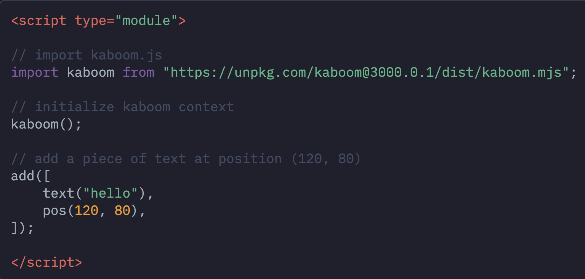
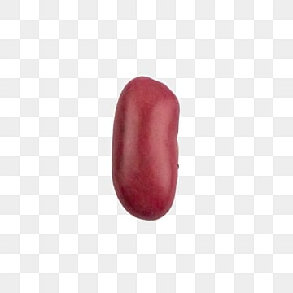
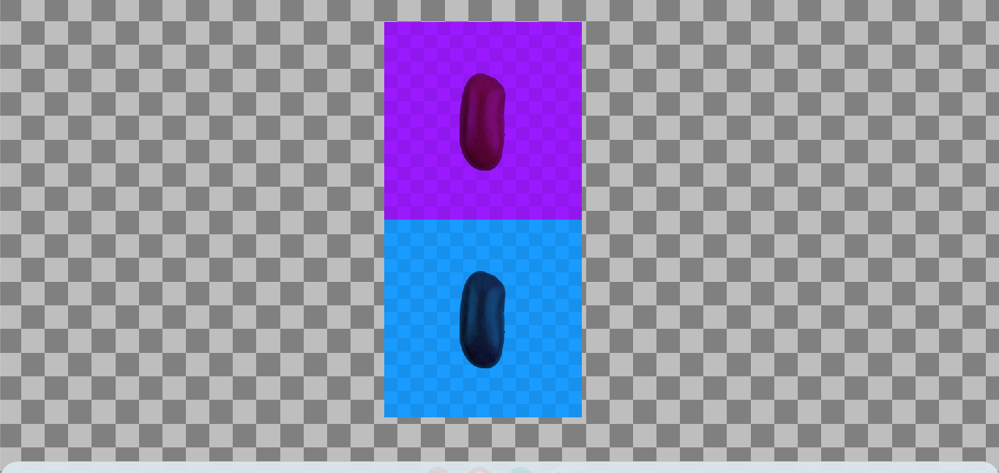

# Tool Learning Log

## Tool: **Kaboom**

## Project: **2D Platformer**

---

### 9/30/24: Day 1
* Welcome to Day 1 of the learning log. My tool for the freedom project I'm going to make will be Kaboom. To start off I created an html file and created a fullscreen Kaboom canvas using this screenshot below
After checking using `http-server` it was showing the right thing. I also learned that that's the easier way to get started with setting up Kaboom.

We're in the same day, but I changed the text and position of the text that's shown which is "Hello Kaboom". I tried challenging myself by trying to make the text centered in the middle.
### 10/21/24: Day 2
We are in Day 2 and I'm learning to add images to the kaboom background. How I tinkered with this was that I added an image of an actual bean like this
And then I put in the `loadSprite` function which loaded the sprite correctly. Just as long as you put "bean" in the `add[()]` function as well. But the problem was, the bean image was a **fake** png, those evil twerps. Like the last day, I challenged myself by centering the image of the bean. It was a little easier this time.

### 10/31/24: Day 3
So, I took the code from day 2 and added `scale()` and `color()` values to the `add([])` function. Like this:
```js
add([
    sprite("real-bean"),
    pos(525, 300),
    scale(0.75),
    color(25, 155, 255),
])
```
I also cloned this `add([])` and give different `color()`, `scale()`, & `pos()` values for them so the template could show the sprites on each other with different colors like this below 

### 11/18/24: Day 4
Onto day 4, I made a coffee bean fall today. So, on day 4 I followed a gravity example from [this Javascript Example](https://kaboomjs.com/play?example=gravity). And that's not the only thing I did. I also made the bean finally be able to jump. Here were the changes I put to the code.
```js
const play = add([
    sprite("reallyBean"),
	pos(center()),
    scale(0.25),
    area(),
    body(),
])

onKeyPress("space", () => {
	if (play.isGrounded()) {
		play.jump()
	}
})
```
So, what I did was try adding `area()` and `body()` to `add([])` function. However, it turns out I had to name that a variable like play for the sprite to work properly. You see, originally I was planning on making the bean jump, but when I pressed space, I got an error message saying that "reallyBean" isn't defined. That's why I used `const play =`.

Now, that I added the Gravity to the bean, it fell off screen. Probably because I didn't put the ground yet. I tinkered with the values of `gravity()` by changing them. When I set the value to 200, the bean fell very slow. But when I set the value higher than 2000, the bean fell very fast.

### 12/2/24: Day 5
Ahh, nothing like Day 5 on December. So, I left off with a coffee bean falling off screen because I didn't set the ground yet. Today is the day I do that. I simply took the code from Kaboom to make the ground:
```js
add([
    rect(width(), 48),
    pos(0, height() - 48),
    outline(4),
    area(),
    body({ isStatic: true }),
    color(127, 200, 255),
])
```
First off `rect()` makes a rectangle, `outline()` speaks for itself (it makes an outline) and the `isStatic` that's inside `body({})` makes it so that the platform has no movement and any object that does move will in fact interact with the platform. A way I tinkered this was by uncommenting certain characterisitcs inside the `add([])` like the `body()` and `pos()`. After uncommenting those, my ground was on the top which still lead the coffee bean to fall off screen. Turns out if you include the `body()` and `pos()`, the ground will be normal and be on the bottom.

### 12/10/24: Day 6
For the next day, I learned to add an obstacle to my kaboom by following along. What I did first however was make that object go in the middle, so the bean can stand on top of it. This wasn't my initial plan. The first thing I did was take the code from day5.html and add this code from Kaboom:
```js
add([
    rect(48, 64),
    area(),
    outline(4),
    pos(width(), height() - 48),
    anchor("botleft"),
    color(255, 180, 255),
    move(LEFT, 240),
]);
```
What this did was make the platform move from right to left. After this, I tinkered with the values and uncommented the `move()` method, so it wouldn't move. But the issue was that the platform was no longer there. It must've had something to do with the position, so I tinkered with the position, by changing it to be at the center. I then afterwards used `body({ isStatic: true })` to make the obstacle interactable with the bean. This was my tinkered code:
```js
add([
     rect(50, 150),
     area(),
     outline(4),
     pos(705, 595),
     anchor("botleft"),
     body({ isStatic: true }),
     color(255, 180, 255),
     // move(LEFT, 240),
 ]);
```
I also changed the `rect()` value and made the rectangle size smaller. Now when this code was placed in `http-server` it showed the rectangle being a block that the coffee bean sprite is standing on.

### 12/16/24: Day 7
We are now on Day 7 and I gotta say I've been having the problem with my results. For some reason whenever I'm using my personal computer to find a result, it isn't the same as my chromebook result. This is the day that I learned something.
```js
add([
     rect(64, 64),
     area(),
     outline(4),
     pos(780, 647),
     anchor("botleft"),
     body({ isStatic: true }),
     color(255, 180, 255),
     // move(LEFT, 240),
 ]);
 ```
 Here you'll see a code from my previous day and the problem that I discovered was with the `pos()` values. You see, the first value of the positioning determines which side from left to right the obstacle goes on while the second value determines where in terms of top to bottom the obstacle goes. These both vary depending on what size screen of device you're using. I learned how to make the x value of positioning centered on any screen. To do this, I simply divided the `width()` by 2 because to find the middle value you must divide the wideness of something in half to find the quotient which will be your middle value. After doing this it worked successfully, but the height was different when I tested it on my chromebook. So, I thought what if I divided the `height()` by 2 as well to balance out the height. Well first off, that did work as well, but it was directly at the center and I wanted to be somewhere in the bottom. So I tried dividing by 4, but that got my obstacle higher, so I then thought maybe if I multiply it by the fraction of 4 it will be brought down. This was my code after the changes.
 ```js
 add([
     rect(64, 64),
     area(),
     outline(4),
     pos(width()/2, height()*0.75),
     anchor("botleft"),
     body({ isStatic: true }),
     color(255, 180, 255),
     // move(LEFT, 240),
 ]);
 ```
 This was able to work correctly and go somewhere in the bottom.
 ### 12/28/24: Day 8
 This could be the last day I tinker with my tool on 2024. (I'll tinker more on 2025 though.) I did notice that my centered bean had a different position on my devices. While, the obstacle was able to in the same position for all my screens. I did this on my computer and sometimes the bean just disappears or falls off the obstacle. So I decided to change the `pos()` value of the sprite landing to the same values as the positioning of the obstacle, but I tinkered with the numbers the `width()` and `height()` would be divided by.
 ```js
const play = add([
    sprite("reallyBean"),
	pos(width()/2.05, height()/4),
    scale(0.25),
    area(),
    body(),
])
```
So, what I did here was divide the height by 4 so it can be higher and not too close to the obstacle. After testing this out, this successfully worked. But, I also wanted to center the bean more on any screen. And that's when I decided to change the number the `width()` would be divided by and when I increased it by 0.05, it went more to the right and successfully landed on the obstacle center.

### 1/6/25: Day 9
New Year, new day to work on my tool, so let's start. So, what I did was work more on the event function known as: `onkeydown()`. What this function did was allow the sprite to commit an action whenever a key was held down. I tried this with my sprite using this code.
```js
onKeyDown("left", () => {
    play.move(-100, 0)
})

onKeyDown("right", () => {
    play.move(0, 100)
})
```
This would allow my sprite to move left and right when I click the left and right arrows on my keyboard. But when I did `http-server`, I noticed it was only moving left and not right and that's okay. Remember, it's important to embrace failure. I then realized that since the first value of `onKeyDown("right")`'s `play.move` was zero, it didn't have the speed to move. Turns out if you change the value to be negative, it will move left. So I changed it to 100 and left the second value at zero, and it was able to move left and right successfully.

Also, to make things more organized, instead of having to press "w" to make the sprite jump, I had the "up" arrow be pressed to make the sprite jump. I just put the word up in the `onKeyPress`.

#### 2/28/25: Working On Project (Day 1)
I am back after Day 9, but instead of working with my tool, I'm starting on creating my project. So, I first set up a plan for this Project. This plan was to create a simple level for my 2D Platformer Project. What's different about my project is that instead of moving the sprite, the user has to move the obstacles and the player has to jump and not fall off. I broke this plan into few objectives.
* Create Obstacles
* Create Sprite
* Make sprite interactable
* Create background
This was how I decomposed this plan.

As for the creating of the project, I defined three variables that all represent different platforms. Right now, they're all red. and have the following properties:
```js
            rect(104, 104),
            area(),
            outline(4),
            pos(width()/3.5, height()*0.75),
            anchor("botleft"),
            body({ isStatic: true }),
            color(250, 0, 0),
```
These are all nested in an `add([])` function and the `pos()` value varies on other platforms. What popped up as a result were three big squares that I can move with the "a" (left) key and the "d" (right) key. Now how did I do that? I just used the `onKeyDown` concept along with `.move` for all those platforms like this:
```js
 onKeyDown("a", () => {
		movePlatform1.move(-200, 0)
        movePlatform2.move(-200, 0)
        movePlatform3.move(-200, 0)
})

onKeyDown("d", () => {
		movePlatform1.move(200, 0)
        movePlatform2.move(200, 0)
        movePlatform3.move(200, 0)
})
```
I also made the platforms move faster by upping the speed 100 more than the speed given on my practice tool files.

#### 3/3/25 Working On Project (Day 2)
Alright, it's a new day and I finally created my sprite. So, I created a sprite in Adobe Photoshop for the users to play as as part of my plan for this Freedom project. This sprite represents a snail with a colored shell along with legs that have wheels on them. Now, I put this sprite in my `index.html` by using the `loadSprite()` concept. I called it "snailroller" along with naming the source of the photo, like this:
```js
            loadSprite("snailroller", "mysprite.png")
            setGravity(1650)
```
I did also set the gravity to 1650 from one of my practice files. Then, I gave the sprite the same properties and values as the coffee bean sprite from the practice files and made that the variable called "player".
```js
            var player = add([
            sprite("snailroller"),
            body({ isStatic: true }),
            pos(width()/2.25, height()/4),
            scale(0.25),
            area(),
            ])
```

#### 3/17/25 Working On Project (Day 3)
So, while I was testing out my sprite and the platforms, I noticed the friction was a bit off between the sprite and the moving platforms. When I move the platforms, the sprite decides to move with them but I don't want that. So I tried asking Slack for help, but unfortunately no one replied with helpful tips. So, I just said "screw it" and ignored it by adding two more platforms with one being very small and one having the same value as that one platform on the right side.
```js
var movePlatform4 = add([
            rect(49, 49),
            area(),
            outline(4),
            pos(width()/1.3, height()*0.75),
            anchor("botleft"),
            body({ isStatic: true }),
            color(250, 0, 0),
            // move(LEFT, 240),
 ]);

 var movePlatform5 = add([
            rect(104, 104),
            area(),
            outline(4),
            pos(width()/1.70, height()*0.75),
            anchor("botleft"),
            body({ isStatic: true }),
            color(250, 0, 0),
            // move(LEFT, 240),
 ]);
 ```
 Then I did some basic stuff like change the background to a blue-ish green color by using `setBackground()`. I once had the idea of using color gradient, but I don't think that works with Kaboom. I also made it so the player can press "space" (later to be w) to have the sprite jump.

 Right now, it just looks like I'm trying to have the sprite not fall, by moving the platforms enough for the snail to move and be able to jump and land on platforms. I plan on seeing that the background is temporary, as I want to work on my background from Photoshop.
 

<!--
* Links you used today (websites, videos, etc)
* Things you tried, progress you made, etc
* Challenges, a-ha moments, etc
* Questions you still have
* What you're going to try next
-->
