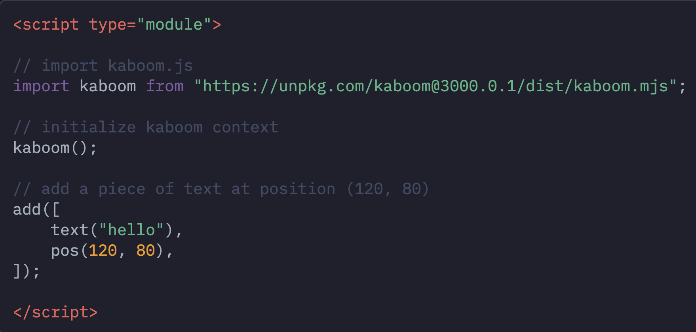

# Tool Learning Log

## Tool: **Kaboom**

## Project: **2D Platformer**

---

### 9/30/24: Day 1
* Welcome to Day 1 of the learning log. My tool for the freedom project I'm going to make will be Kaboom. To start off I created an html file and created a fullscreen Kaboom canvas using this screenshot below
After checking using `http-server` it was showing the right thing. I also learned that that's the easier way to get started with setting up Kaboom.

We're in the same day, but I changed the text and position of the text that's shown which is "Hello Kaboom". I tried challenging myself by trying to make the text centered in the middle.
### 10/21/24: Day 2
We are in Day 2 and I'm learning to add images to the kaboom background. How I tinkered with this was that I added an image of an actual bean like this
And then I put in the `loadSprite` function which loaded the sprite correctly. Just as long as you put "bean" in the `add[()]` function as well. But the problem was, the bean image was a **fake** png, those evil twerps. Like the last day, I challenged myself by centering the image of the bean. It was a little easier this time.

<!--
* Links you used today (websites, videos, etc)
* Things you tried, progress you made, etc
* Challenges, a-ha moments, etc
* Questions you still have
* What you're going to try next
-->
